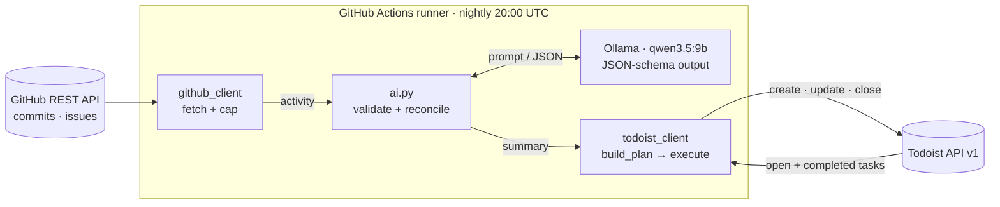

# github-daily-agent

A nightly agent that turns a GitHub repo's activity into a Todoist to-do list.
Every night a GitHub Actions job reads the day's commits and issues, and a
local LLM (running *inside* the Actions runner via Ollama) turns them into
short task titles and a daily recap. The agent then syncs them into Todoist:
one task per open issue, a "Done on <date>" summary, and closed issues
checked off. It runs for $0, needs no server or database, and running it
twice changes nothing.

## Architecture



`main.py` only wires these together. `--dry-run` stops after printing the
plan.

## How sync works

Every task the agent creates carries a marker in its description, e.g.
`[gh-agent:owner/repo#12]` for issue #12 or
`[gh-agent:owner/repo:summary:2026-09-27]` for a day's recap. The markers
are the only state; there is no database. Each run:

1. **New open issue** → creates a task, due tomorrow.
2. **Issue still open, task still open** → leaves it alone. If the task is
   overdue, moves it to tomorrow so it stays on your list.
3. **Issue closed** → completes its task.
4. **You completed the task, but the issue is still open** → respects that
   and does *not* recreate it.
5. **Something got done today** → creates one "Done on <date>" task
   listing it, due tomorrow morning. Once per day.

Deciding what to do is a pure function (`build_plan`) over GitHub activity
and current Todoist state; a separate executor applies the plan. That makes
the rules unit-testable, makes `--dry-run` trivial, and guarantees a second
run plans **0 actions**.

The LLM only writes text (task titles, recap lines). It never produces
markers or IDs, and its output is schema-validated: unknown issue numbers
are dropped, skipped issues fall back to their GitHub title, and invalid
output is retried once and then fails the run, so nothing is written.

## Key decisions

Full reasoning is in [docs/DECISIONS.md](docs/DECISIONS.md); verified API
behavior is in [docs/API_NOTES.md](docs/API_NOTES.md).

- **Local LLM in CI (Ollama on the runner).** $0 per run, no API key, and
  repo activity never goes to a third-party LLM vendor (only the finished
  tasks go to Todoist). The AI sits behind a small provider interface
  (`providers/base.py`), so a hosted model can be swapped in via config.
- **Thinking off + JSON-schema output.** `think: false` made inference
  about 10× faster; the `format` schema made output shape reliable.
- **Markers instead of a database.** Todoist itself is the state.
- **Plan, then execute.** Pure planning plus a thin executor; dry-run for free.
- **Keepalive workflow.** GitHub disables schedules in public repos after
  60 days without activity; a monthly job re-enables them.

## Setup

1. **Fork** this repo, then enable workflows in your fork's **Actions** tab
   (forks start with them disabled).
2. **Edit `config.json`**. At minimum, set `target_repo`:

   | Field | Default | Meaning |
   |---|---|---|
   | `target_repo` | — | `owner/name` of the repo to watch |
   | `timezone` | — | IANA zone used for "today" / "tomorrow", e.g. `Asia/Tehran` |
   | `ai_provider` | — | `ollama` (only provider so far) |
   | `ai_model` | — | Ollama model tag, e.g. `qwen3.5:9b` |
   | `output_language` | `en` | `en` or `fa` for task titles and recap |
   | `task_sink` | — | `todoist` (only sink so far) |
   | `todoist_project` | — | Project name; created on first write if missing |
   | `lookback_hours` | `24` | Window for commits and recently closed issues |
   | `max_commits` | `50` | Cap, to keep the prompt small |
   | `max_issues` | `30` | Cap on open and on recently closed issues |
   | `issue_body_chars` | `300` | Issue bodies are truncated to this |

3. **Create a fine-grained GitHub PAT**
   (Settings → Developer settings → Fine-grained tokens):
   - Repository access: **Only select repositories** → your `target_repo`
   - Repository permissions: **Contents: Read-only**, **Issues: Read-only**
     (Metadata: Read-only is added automatically)

   A PAT is used instead of `GITHUB_TOKEN` so the target can be any repo,
   including a private one. Note its expiry date.
4. **Get your Todoist API token**: Todoist → Settings → Integrations →
   Developer.
5. **Add both as repo secrets**:

   ```bash
   gh secret set GH_PAT
   gh secret set TODOIST_API_TOKEN
   ```

6. **Try it**: Actions → **agent** → Run workflow. `dry_run` is checked by
   default, so it only prints the plan. Uncheck it for a real run. The
   nightly scheduled run always writes to Todoist.

If a run fails, you get a Todoist task "Daily agent failed — <run url>"
due today.

## Local development

Requires Python 3.12+ and, for a full run, [Ollama](https://ollama.com).

```bash
python -m venv .venv && source .venv/bin/activate
pip install -r requirements.txt -r requirements-dev.txt -e .
cp .env.example .env          # fill in GH_PAT and TODOIST_API_TOKEN

python -m agent.github_client  # what the agent sees from GitHub
ollama pull qwen3.5:9b         # with `ollama serve` running
python -m agent.main --dry-run # full pipeline, prints the plan only

pytest -q                      # unit tests, no network
ruff check .
```

## Limitations

- **CPU inference.** A nightly run takes about 3–4 minutes, 1–2 of them
  model inference. Quality is capped by what fits a free 16 GB runner.
- **Wording varies between runs**, even at temperature 0. Harmless:
  dedupe keys on markers, not titles. Titles are set once, at creation.
- **Caps.** Busy repos are truncated to the newest 50 commits and 30
  issues so the prompt fits the model's context.
- **Memory of completed tasks is ~3 months** (Todoist API limit). A task
  you *delete*, rather than complete, is recreated on the next run.
- **One repo, one sink.** GitHub may also start scheduled runs late at busy
  times.

## Roadmap

- [ ] Multiple repos per run
- [ ] Notion as a second task sink (via `providers/`)
- [ ] Optional hosted LLM provider
- [ ] End-to-end test ([#5](https://github.com/arashzree/github-daily-agent/issues/5))

Task status lives in [docs/PLAN.md](docs/PLAN.md).
